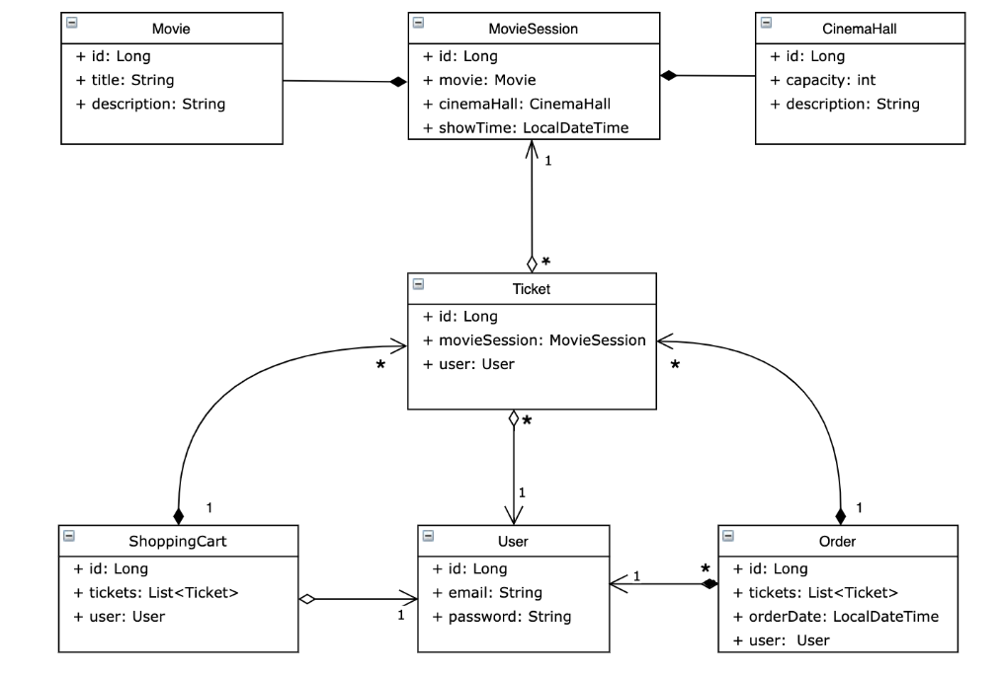
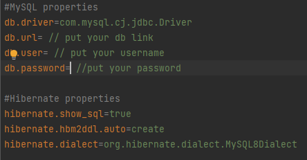

# 🎥Cinema-REST-API

## 📄 Description:
REST-API supports user authentication,
authorization and CRUD operations.
Allow add movie session to cinema hall, and find available session
Created using Spring & Hibernate.
## 💻Main technology stack:
Java 17, Spring Security, Spring Web MVC, Hibernate, MySQL 8.0, Tomcat 9.0.75, Maven



## 📂 Project structure:
- config -contains config classes required by Spring & Hibernate.
- controller -all http controllers.
- dao -classes responsible for crud operations with db.
- exception -custom exceptions.
- lib -custom validators for email, password and confirm password.
- model -model classes for entities shown in scheme above.
- service -classes that are responsible for business logic and connecting dao with controllers
- service/mapper -mappers that are used to parse dto to entity and entity to dto.
- util -util class containing date pattern

#### resources/
- db.properties -file containing database and Hibernate properties.
### 📄 How to use application
Requires Intellij and jdk 17 already installed
First you will need to pull this project from github. Here link to this project.
````
git@github.com:Rolik-Oleksandr/cinema-rest-api.git
````

1. Clone this repo to you IDE.
2. Create new run configuration tomcat_local
3. Replace username, password, driver and url in resources/db.properties with your own.

4. Run "mvn clean package" command in your terminal.
5. If everything okay - start Tomcat and try app.

